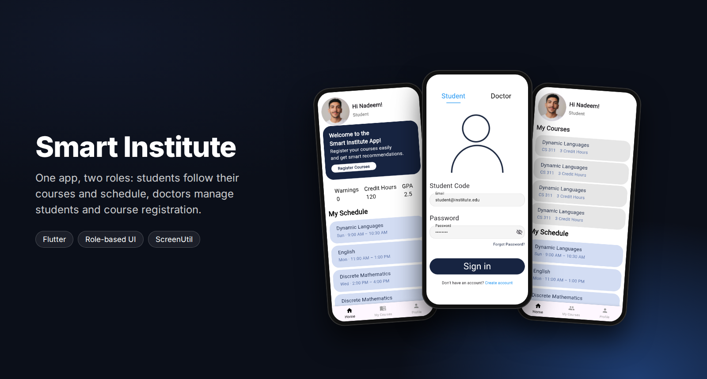
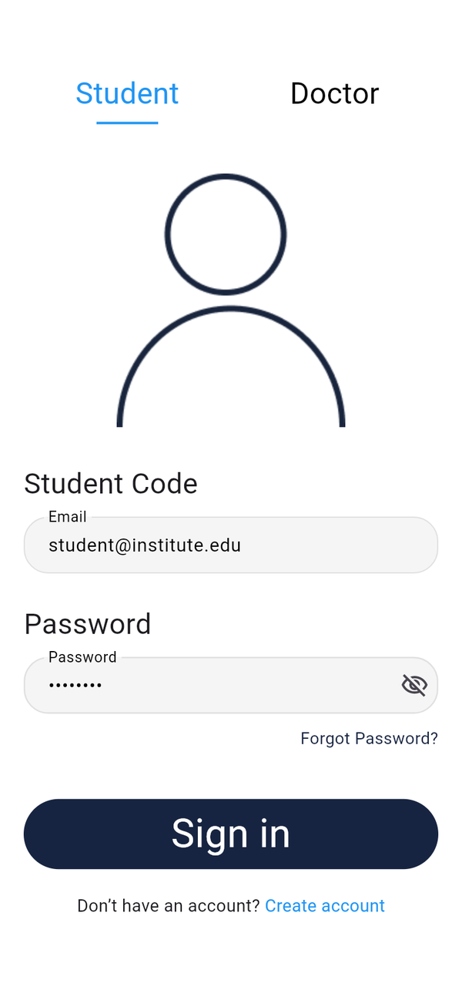
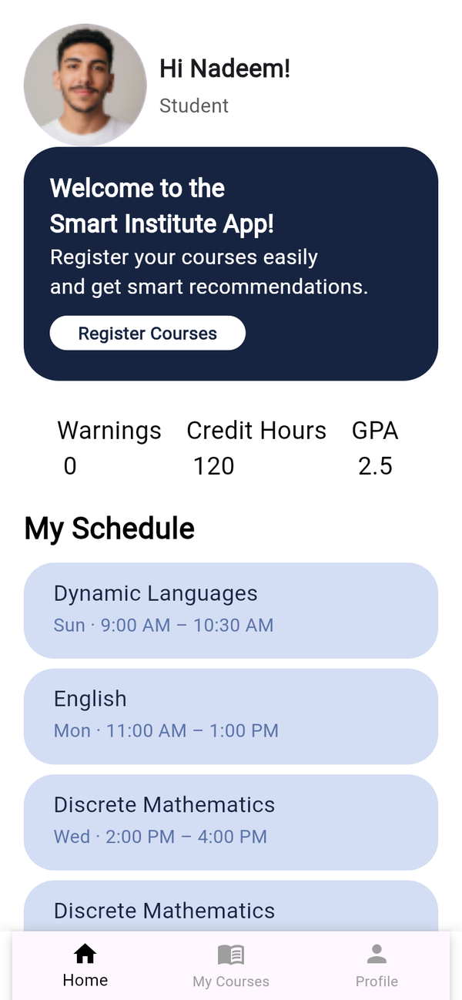
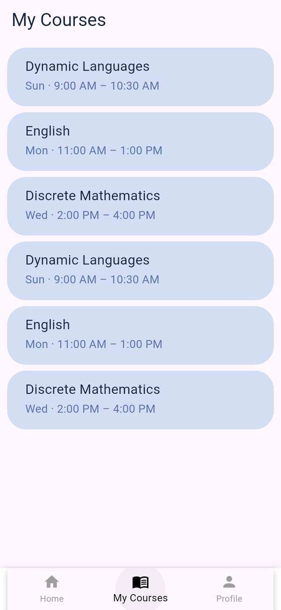
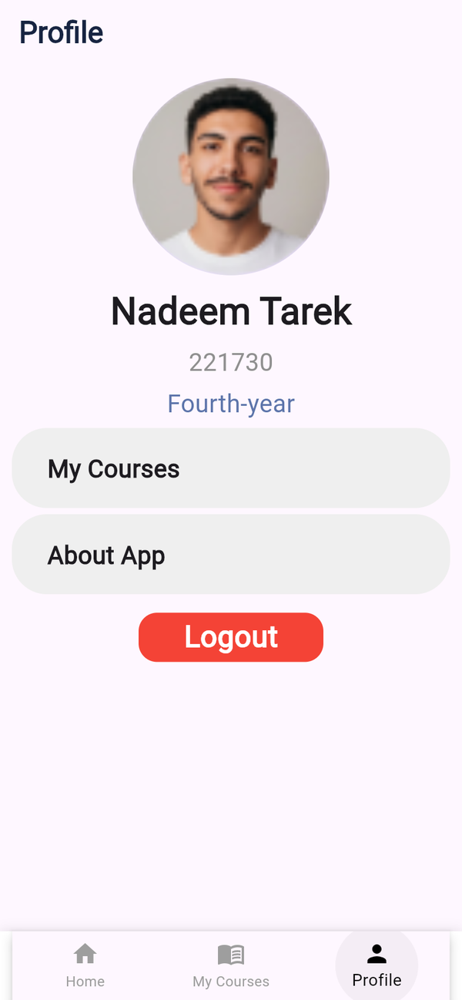
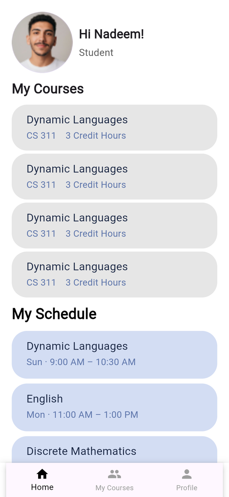
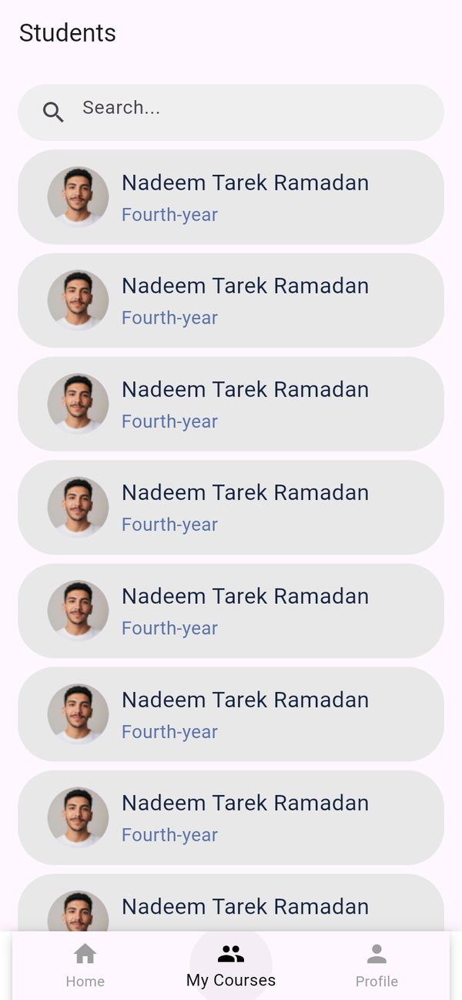
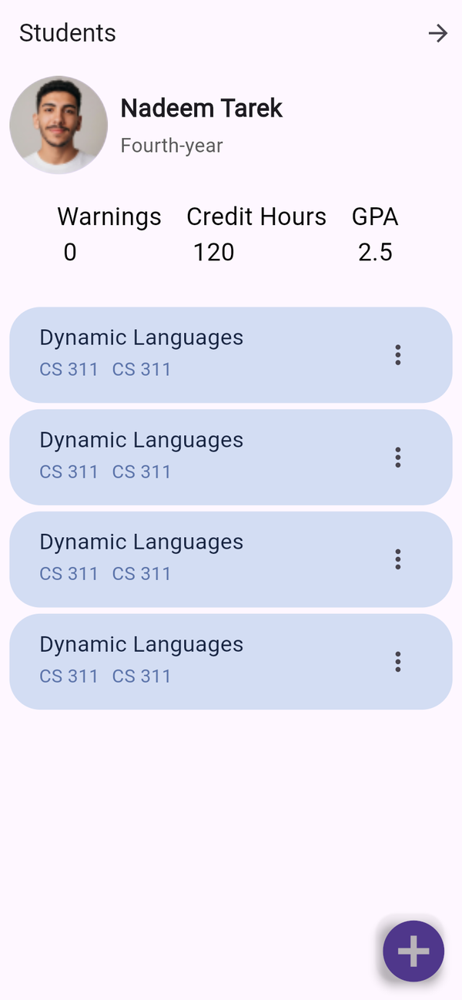
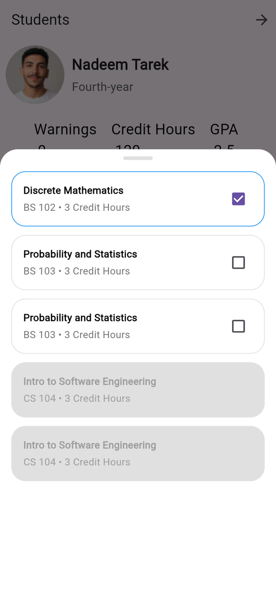

<div align="center">



<br/>

[](https://flutter.dev)
[](https://dart.dev)
[](#two-roles-one-app)

**A mobile app for an institute's students and doctors.**
Students see their courses, weekly schedule, GPA and warnings.
Doctors see their courses and students, and register courses for each student.

</div>

---

## Screenshots

### Student

<table>
  <tr>
    <td align="center"><br/><sub><b>Onboarding</b><br/>Shown on first launch</sub></td>
    <td align="center"><br/><sub><b>Sign in</b><br/>Student / Doctor tabs</sub></td>
    <td align="center"><br/><sub><b>Home</b><br/>GPA, credit hours, schedule</sub></td>
    <td align="center"><br/><sub><b>My courses</b><br/>Day and time of each class</sub></td>
    <td align="center"><br/><sub><b>Profile</b><br/>ID, level, logout</sub></td>
  </tr>
</table>

### Doctor

<table>
  <tr>
    <td align="center"><br/><sub><b>Home</b><br/>Courses and schedule</sub></td>
    <td align="center"><br/><sub><b>Students</b><br/>Searchable list</sub></td>
    <td align="center"><br/><sub><b>Student file</b><br/>GPA, hours, enrolled courses</sub></td>
    <td align="center"><br/><sub><b>Register courses</b><br/>Pick courses for a student</sub></td>
  </tr>
</table>

## Two roles, one app

Both roles share the splash screen, onboarding and sign-in, then each gets its own home and
bottom navigation.

**Student**
- Home with a welcome card, warnings, completed credit hours and GPA
- Weekly schedule with the day and time of every class
- My courses and a profile screen with student ID and level

**Doctor**
- Home with the doctor's courses (code and credit hours) and teaching schedule
- Student list with search
- Student file with GPA, credit hours and enrolled courses
- A bottom sheet to register new courses for a student, with already-taken courses disabled

**Shared**
- Onboarding on first launch only, remembered with `shared_preferences`
- Sign-in form with validation and a password visibility toggle
- Responsive sizing with `flutter_screenutil`

## Tech stack

| Area | Choice |
|:--|:--|
| Framework | Flutter, Dart |
| Onboarding | `introduction_screen` |
| Local storage | `shared_preferences` |
| Responsive UI | `flutter_screenutil` |
| Splash | `flutter_native_splash` |

```
lib/
├── core/
│   ├── widget/            shared widgets (app bar, text field, password field)
│   ├── widget_doctor/     doctor widgets (student list, course cards, register dialog)
│   └── widget_student/    student widgets (schedule, courses, bottom bar)
├── factore/
│   ├── auth/login/        sign in
│   ├── doctor/            doctor home and students
│   ├── onboarding/        onboarding flow
│   ├── smart_institute/   app root and splash
│   └── student/           student home, courses, profile
└── main.dart
```

## Getting started

```bash
flutter pub get
flutter run
```

The app runs on sample data. To try each role, sign in with any password and an email that
contains `student` (for example `student@institute.edu`) or `doctor`.

## Roadmap

- [ ] Connect to a backend for students, courses and registration
- [ ] Course recommendations for students
- [ ] Attendance and grades

## Author

**Osama Yosef** · Flutter developer, Cairo

[](https://github.com/osama-Yosef)
[](https://www.linkedin.com/in/osama-yosef-819268319)
[](https://upwork.com/freelancers/~014ebd205ef38ca04c)
[](mailto:osamayosef038@gmail.com)
